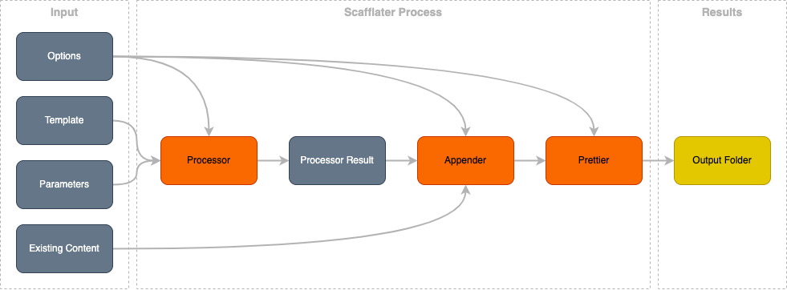

Scafflater is a template engine, design to produce customized and extensible codes. Basically, Scafflater receives some inputs, executes some steps and saves the result on an output folder.



# Inputs

## Options

Options can be used to customize how scafflater works. All options has default values and can be defined on 3 different places:
  - as a input, using npm package or client
  - on the `scafflater.jsonc`, that can be present inside any folder of the template. This file will be striped from result
  - on commented lines inside any file to be process. These lines will be striped from result files

## Template

An Scafflater Template is a simple local directory or a Github repository, with a special folder called `.scafflater` where the scafflater options and other features are configured.

Check a simple scafflater template here at https://github.com/scafflater/sample-template.

## Parameters

Parameters are values used on generation process to customize the output.

# Scafflater Processes

There are three main process on Scafflater to generate code:

## Processor

At this step, Scafflater will read the template folder recursively, running handlebars on file contents, file name and folder names.

### Handlebars

[Handlebars](https://handlebarsjs.com/) are used to render templates. Handlebars can be used on [file content](https://github.com/scafflater/sample-template/blob/main/some-file.txt#L1), [file name](https://github.com/scafflater/sample-template/blob/main/%7B%7Bparameters.param2%7D%7D.txt) and [folder name](https://github.com/scafflater/sample-template/tree/main/%7B%7Bparameters.param3%7D%7D)

## Appender

The appender process will append processor results on existing content, if there is some existing content. The result can be append using many strategies, including an personalized one.

## Prettier

After the content append, (Prettier)[https://prettier.io/] is executed to ensure that the result is well formatted, avoiding many line brakes or failed indentation. 

# Output

The output is a folder with the customized generated files. The result output will contain the `.scafflater` folder with some information about the templates and the parameters used in generation. This folder is important if you desire to expand the generated code with partials.

# Sample
Run the [sample template](https://github.com/scafflater/sample-template) quoted above:

```sh-session
$ npm install -g scafflater-cli

$ scafflater-cli init https://github.com/scafflater/sample-template
```


